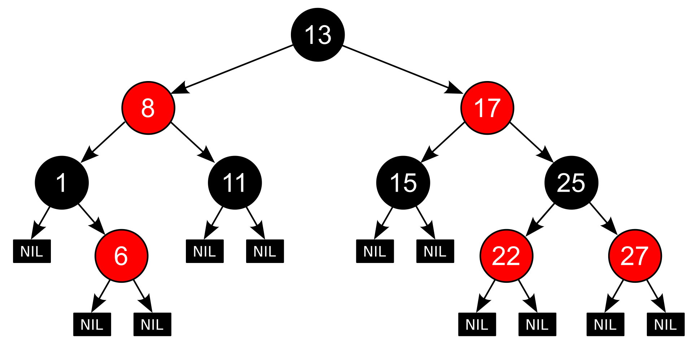
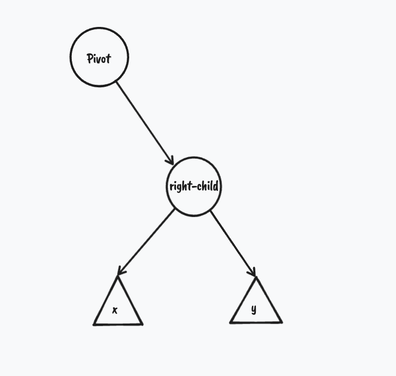
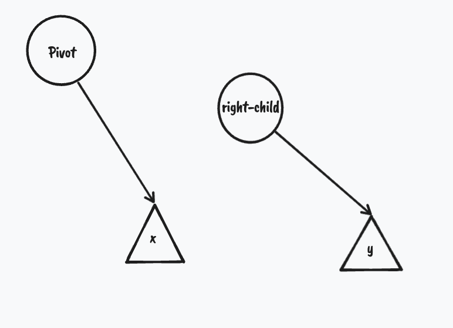
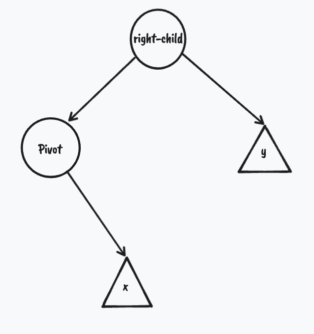
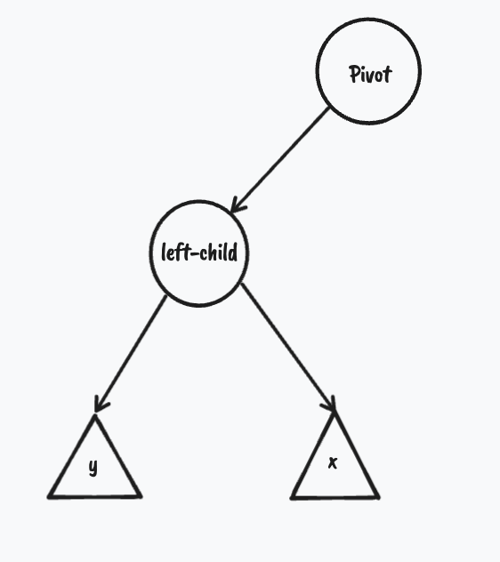
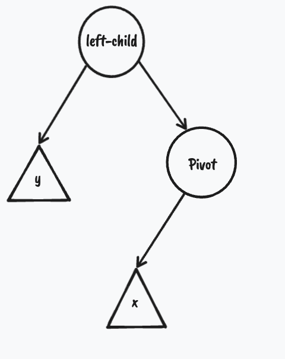
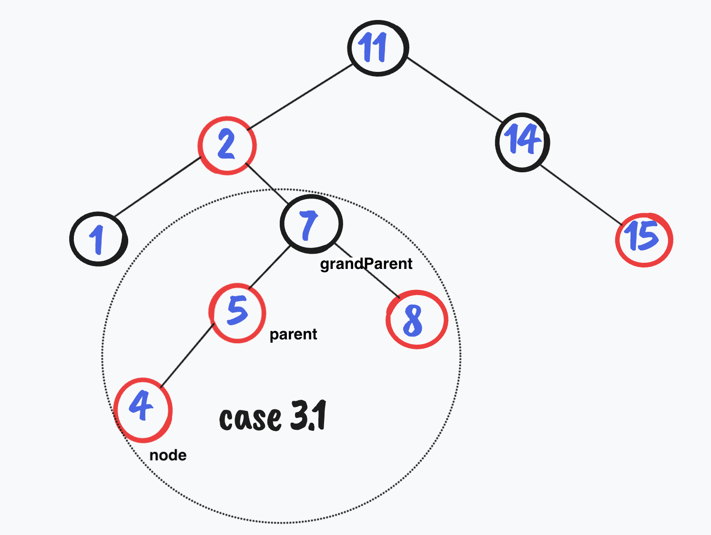
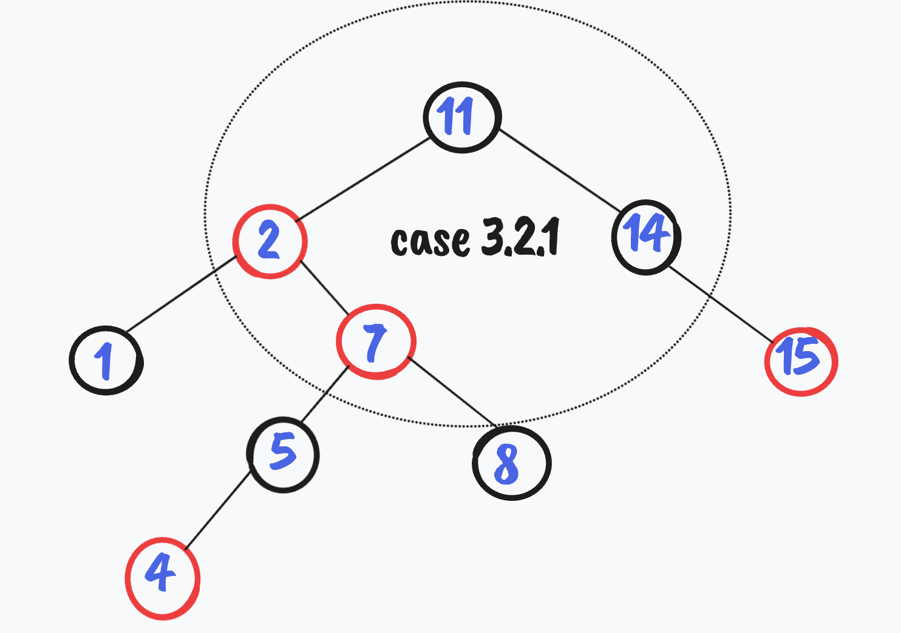
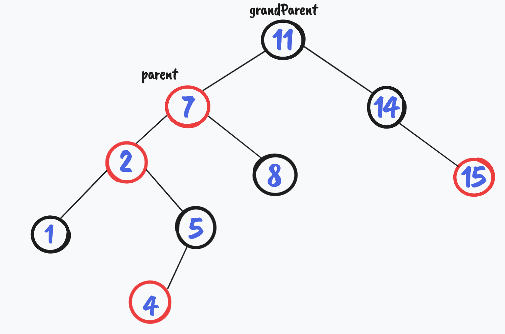
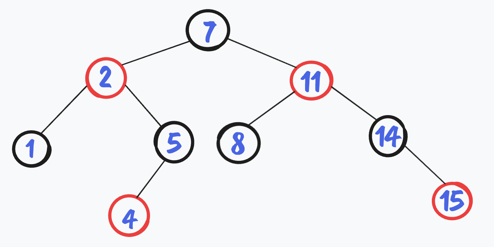

# Red-Black-Trees

A Red-Black-Tree is a binary search tree with one extra bit of storage per node: it's color (either RED or BLACK). By constraining the node colors on any simple path from the root to a leaf, red-black trees ensure that no such path is more than twice as long as any other so that the tree is approximately balanced. Indeed, as we’re about to see, the height of a red-black tree with n keys is at most $2 lg(n + 1)$, which is $O(lg  n)$.

## Red-Black-Tree properties:

1. Every node is either red or black.
2. The root is black.
3. Every leaf (NIL) is black.
4. If a node is red, then both its children are black.
5. For each node, all simple paths from the node to descendant leaves contain the same number of black nodes.

## Rotations:

### Left Rotation:

  

 a subtree with Pivot the node we want to start the Left Rotation on. 

1. The first step is the move the right-child→left (x) to be the Pivot’s right. If you are wondering why ‘x’ and not ‘y’ while rotating the tree must stay a binary search tree so the right child is definitely greater than the pivot, so the most accurate place to put the pivot in is the left of the right-child.
    

  

    
2. The pivot becomes the right-child→left 
    

  

 
 the subtree after Left Rotation. 

    
    
    
    
### Right Rotation :
    
    Repeat the same steps but with the left-child this time
    
  

  

 subtree to Right Rotate. 

    
    
    

  

 subtree after  Right Rotation. 

### Double Rotations.

    Left Right Rotation(Pivot) = Right Rotation(Pivot→right) + Left Rotation(Pivot).

    Right Left Rotation(Pivot) = Left Rotation(Pivot→left) + Right rotation(Pivot)

## Insertion:

1. insert the key first in the binary search tree with one extra thing (RED color),  every new key inserted is RED so the properties of the Red-Black_Tree can be violated.
2. fix the violation.

**case 1**: the tree is empty *(all good )*.

**case 2**: Parent is Black *(all good)*.

**case 3**: Parent is RED **( property 4 is violated)**

**case 3.1:** Uncle is RED 

1. set the color of parent and uncle to BLACK and grandParent to RED 
2. move node to the grandparent and repeat.

**case 3.2:** Uncle is BLACK

case 3.2.1: Parent is a right_child and node is a right_child.

  1. set the color of the parent to BlACK and the grandParent to RED.

1. Left-Rotate the grandParent.

case 3.2.2: Parent is a left_child and node is a left_child.

1. Set the color of the parent to BLACK and the grandParent to RED.
2. Right-Rotate the grandParent.

case 3.2.3: Parent is a right_child and node is left_child.

1. move node to the parent.
2. Right-Rotate node.
3. Set the color of the parent to BLACK and the grandParent to RED.
4. Left-Rotate the grandParent.

case 3.2.4: Parent is a left_child and node is right_child.

1. move node to the parent.
2. Left-Rotate node.
3. Set the color of the parent to BLACK and the grandParent to RED.
4. Right-Rotate the grandParent.

*Don’t forget to reset the root’s color to BLACK at the End.*

### Visualization:

  

Set color of parent and uncle to BLACK and move node to grandParent. 

  

move node to parent and Left-Rotate node.

  

set parent color to Black and grandParent to RED. Right-Rotate grandParent.

  

Balanced Red-Black-Tree.
